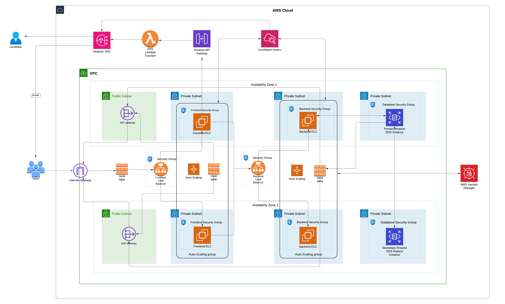
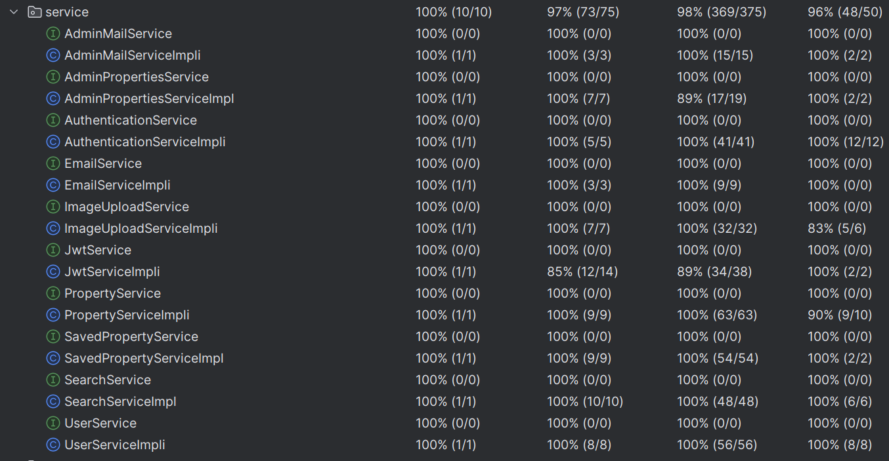

# DALHOUSINGEASE

## VERIFIED HOMES, PEACE OF MIND!

DalHousingEase makes renting property easier. This marketplace brings landlords and tenants together on one platform. It uses new technology to give users a smooth experience.

The backend of DalHousingEase uses Java with Spring Boot and JPA. This combo creates strong ready-for-use applications that handle data well. JWT (JSON Web Token) keeps users safe by making sure each login stays secure. React.js powers the frontend giving users a lively and quick-to-respond interface. The app looks good and works well on all devices thanks to CSS, Tailwind, and Bootstrap. These tools help create a fresh easy-to-use design.

MySQL makes data management easier, and Cloudinary takes care of storing images, which simplifies handling media. The project aims to keep code easy to maintain and high in quality by using Lombok to cut down on repetitive code, ModelMapper to map objects well, and JUnit and Mockito to test units and achieve TDD in the development cycles.

Besides being easy to use, DalHousingEase stands out because it cares about quality. An admin checks every property listed on the site, and a tag shows it's been verified next to the property details. This means tenants see the most real and trustworthy listings. And also it offers a direct chat opportunity with the property Lister about listing and its details which makes renting both fun and reliable.

On the cloud, the project is hosted using AWS, employing various services for scalability, reliability, and security. The architecture follows a multi-AZ (Availability Zone) deployment pattern to ensure high availability.

## Built with:

•	Java  
•	Spring Boot  
•	Maven  
•	Bootstrap  
•	Tailwind CSS  
•	MYSQL  
•	JUnit  
•	Mockito  
•	JPA  
•	JSON web tokens  
•	SLF4J  
•	React JS  
•	cloudinary  
•	Lombok  
•	Docker

**Cloud Services:**
  
•	AWS EC2 (Frontend & Backend)  
•	AWS RDS (MySQL)  
•	AWS Lambda  
•	Amazon SNS  
•	AWS Secrets Manager  
•	Amazon CloudWatch  
•	VPC with public/private subnets   
•	Amazon API Gateway  
•	NAT Gateway  
•	Application Load Balancer 

## Roles and Responsibilities:

## Admin:
### Review Listings:
- The Admin reviews all property listings submitted by Property Listers and sends verfication email with a google form to get required documents for verification.

### Verification:
- The Admin verifies the provided documents for each listing received through a form shared during verfication email .
  Accept/Reject Listings: Based on the verification, the Admin either accepts or rejects the listings.

## Property Lister:
### List Properties:
- Property Listers can add new property listings to the platform.
### Manage Listings:
- Property Listers can edit or update and delete their property listings.
### Address Autocomplete:
- Utilize Google Maps API for auto-completing property addresses during listing.

## Property Seeker:
### View Properties:
- Seekers can view all the listed properties.
### Verified Listings:
- Only properties verified by the Admin are marked with a verification tag.
### Search & Filters:
Seekers can filter properties based on:
- Property Type
- Monthly Rent Range
- Furnished Levels
- Parking Availability
- Cities
- Number of Bedrooms
- Number of Bathrooms

### Wishlist:
Seekers can add properties to their wishlist for future reference or remove them from the wishlist.

## Authentication:
### Signup/Login:
- All users need to sign up and log in to access the application.
### Change Password:
- Users can change their password anytime.
### Forgot Password:
- If a user forgets their password, they can request a password reset link sent to their registered email.
### API Integration
### Google Maps API:
- Integrated for auto-completing property addresses to enhance user experience during property listing.

## Usage:

### Admin
### Login:
- Admin logs in to the application.
### Review Listings:
- Navigate to the 'Pending Listings' section and send verification email with verification form to the email id.
### Verify Documents:
- Review the documents submitted by the Property Lister.
### Accept/Reject:
- Based on the verification, accept or reject the listing and update the status of listings.

## Property Lister
### Login:
- Property Lister logs in to the application.
### List Property:
- Go to 'Add property' and fill in the property details. Use the address auto complete feature powered by Google Maps API.
### Manage Listings:
- Navigate to 'My Listings' to view, edit, or delete properties.

## Property Seeker
### Login:
- Seeker logs in to the application or can search for properties without login .
### View Listings:
- Browse through the listed properties and check the details if need can chat with the lister directly via whatsapp for any clarifications.
### Apply Filters:
- Use filters to narrow down property search based on criteria like type, rent range, furnished level, etc.
### Wishlist Properties:
- Click the 'save' button on the desired property to add it to wishlist. To remove, go to 'Saved properties' and click 'Remove'. and this saving and removing of saved properties requires login .

## Authentication
### Signup:
- New users can sign up using the 'Signup' button on the login page or the landing page.
### Login:
- Existing users log in with their credentials.
### Change Password:
- After logging in, select 'Change Password' to change the password
### Forgot Password:
- On the login page, click 'Forgot Password?' and enter your email to receive a reset link.

## Cloud Architecture Overview

### Architecture Highlights:

1. **VPC and Subnets:**
   - The infrastructure is hosted in a custom VPC with public and private subnets spread across two availability zones.
   - Public subnets host NAT Gateways and Load Balancers, while private subnets house the backend services and databases.

2. **Load Balancers and Auto Scaling:**
   - Frontend and backend load balancers manage incoming traffic and distribute it across EC2 instances.
   - Auto Scaling groups dynamically adjust the number of frontend and backend EC2 instances to meet demand.

3. **Database Layer:**
   - Amazon RDS (MySQL) is used for managing relational data.
   - The primary database instance is deployed in one availability zone, with a replica in another for fault tolerance.

4. **Security Measures:**
   - Security Groups are configured to restrict access to specific ports and protocols.
   - AWS Secrets Manager is used to securely store database credentials and API keys.

5. **Serverless Components:**
   - AWS Lambda and SNS handle notification functionality, such as sending verification emails to property listers.

6. **Monitoring and Logging:**
   - CloudWatch Metrics and Alarms are integrated for monitoring the performance and health of the system.

### Key Components in Architecture:
- **Frontend EC2 Instances:** Host the React.js application.
- **Backend EC2 Instances:** Run the Spring Boot application.
- **Database Instances:** Primary and replica RDS instances ensure data durability.
- **NAT Gateways:** Enable internet access for private subnets.
- **Secrets Manager:** Securely manages sensitive information.
- **API Gateway and Lambda:** Facilitate communication and notifications.

## CloudFormation Overview

This project utilizes AWS CloudFormation for infrastructure as code. Below are key highlights from the CloudFormation template:

### Resources:
1. **VPC Configuration:**
   - A custom VPC (DalHEVPC) with multiple public and private subnets.
   - Internet Gateway and NAT Gateway for routing traffic appropriately.

2. **Compute Resources:**
   - Frontend and Backend EC2 instances configured via Launch Templates.
   - Auto Scaling Groups for scalability.

3. **Networking:**
   - Load Balancers (Frontend and Backend) for managing traffic.
   - Route Tables and Security Groups for controlled network traffic.

4. **Database:**
   - Amazon RDS instance with a DBSubnetGroup for private subnet placement.

5. **Secrets Management:**
   - Secrets Manager securely stores database credentials.

6. **Serverless:**
   - Lambda function and SNS for notifications.
   - API Gateway for exposing the notification functionality.

7. **Monitoring:**
   - CloudWatch Metric Filters and Alarms for tracking errors and sending alerts.

## Cloud Architecture Diagram:
Below is the visual representation of the architecture:

## Test Driven Development
In this project, we have followed Test Driven Development (TDD) practices to ensure high-quality code and reliable functionality. By writing tests before implementing the actual code, we have been able to maintain a high level of code coverage and catch potential issues early in the development process.
### Test Coverage
We have included comprehensive test cases for all major components of our project. Notably, we have also included test cases for the JwtServiceImpl, which, while not initially required contribute to the overall robustness of our application. If we exclude the tests for JwtServiceImpl, our test coverage would be 100%.  

## Conclusion:
DalHousingEase combines a user-friendly interface with robust backend architecture and cutting-edge cloud technologies. The project demonstrates best practices in software development, cloud architecture, and test-driven design to deliver a reliable and scalable solution for property renting.